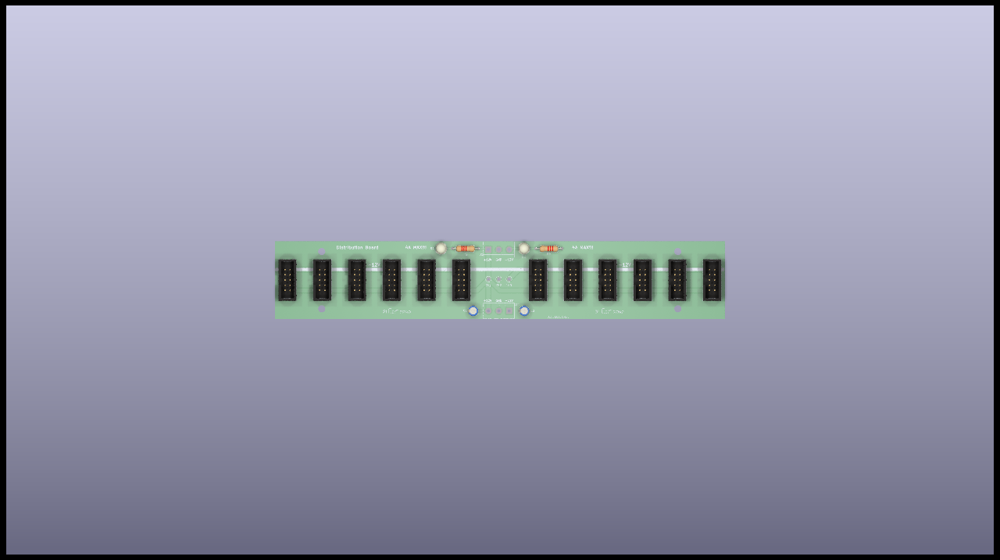
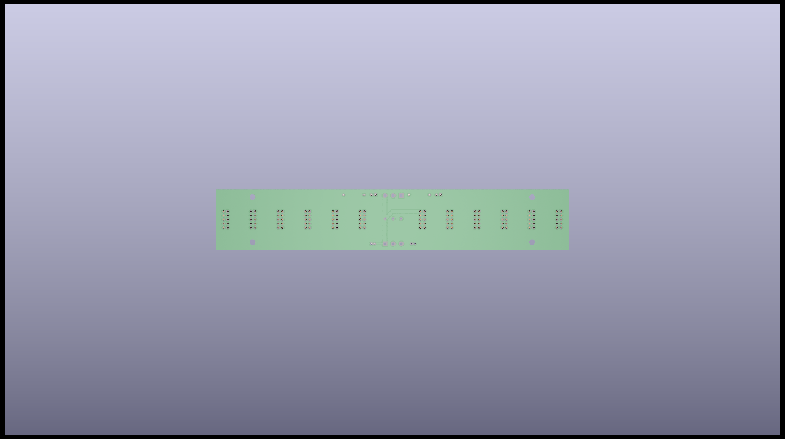
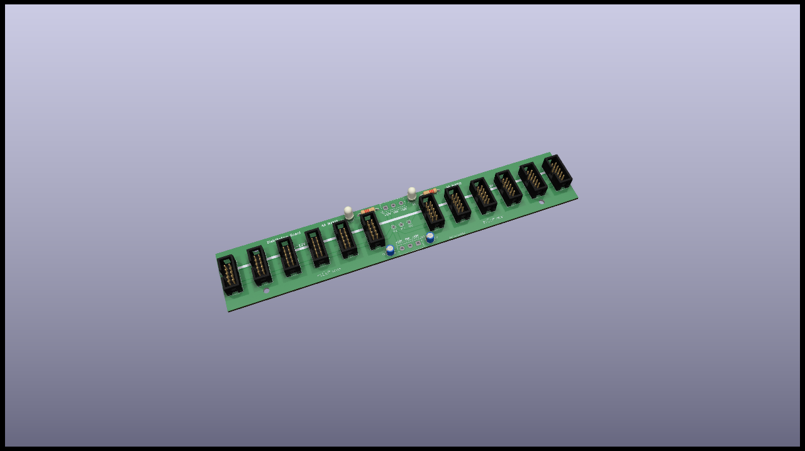

# Distribution board

Basic distribution board, with 12 IDC headers.

10 pins IDC headers used on this board (Because I don't use any 16 pin ones anyway).

You'll find the schematic of this module below: 

:warning: Use M3 standoff/screws to fasten it in place in your eurorack case.

[See bom](documentation/bom/Distrib_V1.0--iBoM.html)

